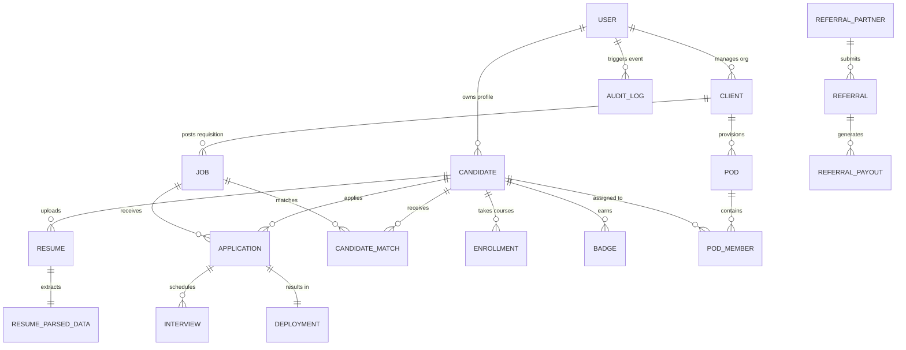

# Pepoltek Limited Master Web Architecture & Developer Blueprint

> **Product**: Pepoltek Limited Web Platform (Enterprise IT & Healthcare Workforce Solutions)  
> **Source Document**: Software Requirements Specification (SRS v1.1)  
> **Target Framework**: Next.js 15+ (App Router), TypeScript, Tailwind CSS, GSAP / Canvas Visuals  
> **Classification**: Master Architecture Blueprint & Engineering Implementation Guide  

---

## 1. Executive System Overview

Pepoltek Limited is a global workforce solutions platform operating two primary business engines:
1. **Technology & SDLC Workforce Solutions**: Pre-vetted software engineering pods, cloud/DevOps squads, data/AI teams, and high-velocity 7-day deployment sprints.
2. **Healthcare & Clinical Workforce Solutions**: Compliance-ready clinical specialists, NHS Band 7/8 nursing rotas, EMR/EHR integration teams, and HIPAA/DBS vetted practitioners.

### Core Business Pillars & Value Propositions
- **7-Day Deployment Velocity**: Average deployment SLA of 6.8 days versus legacy agency latency of 45+ days.
- **In-House Delivery Engine**: Interdisciplinary pod consisting of niche recruitment specialists, business analysts, and software engineers performing hard-coded code reviews and repository validations.
- **AI-HRMS & Talent Ecosystem**: Natural-language candidate search, reverse matching, AI resume parsing, candidate readiness indices, Talent Academy upskilling, and a bounty-driven referral network.
- **Commercial Protection**: Escrow-backed sprint payments, 90-day replacement guarantee, and 100% compliance pass rates (DBS, GMC/NMC, Right-to-Work, IP Assignment).

---

## 2. Global Route & Directory Architecture

The web platform is structured into modular Next.js App Router route groups, separating marketing, authentication, and persona-specific operational dashboards:

```
src/
├── app/
│   ├── layout.tsx                               # Root layout (Fonts: Sora, Inter, JetBrains Mono; Theme tokens)
│   ├── globals.css                              # Design system tokens, CSS animations, Tailwind layer
│   │
│   ├── (main)/                                  # Public Marketing & Brand Showcase
│   │   ├── layout.tsx                           # Main marketing layout (Smooth scroll provider, Header)
│   │   ├── page.tsx                             # Enterprise Landing Page (Hero, Velocity, Pods, Case Studies)
│   │   ├── case-studies/page.tsx                # Enterprise Case Studies & Architecture Benchmarks
│   │   ├── services/page.tsx                    # Staff Augmentation, Pods, EOR, Direct Hire
│   │   ├── technology/page.tsx                  # SDLC Tracks, Tech Stack Matrix, Timezone Overlap
│   │   ├── healthcare/page.tsx                  # Clinical Staffing, NHS Frameworks, Compliance
│   │   ├── about/page.tsx                       # Integrated Delivery Engine, Leadership Track Record
│   │   └── contact/page.tsx                     # Dual-Track Lead Generation & Consultation Intake
│   │
│   ├── (auth)/                                  # 256-Bit Encrypted Authentication Node
│   │   ├── layout.tsx                           # Branded secure shell with ambient cyber backdrop
│   │   ├── login/page.tsx                       # Multi-role Login (Candidate / Recruiter / Admin) + SSO
│   │   ├── register/page.tsx                    # Track-based Registration Wizard (Tech / Healthcare / Recruiter)
│   │   ├── verify/page.tsx                      # 6-Digit OTP security code auto-advancing verification
│   │   ├── forgot-password/page.tsx             # Magic link recovery dispatch
│   │   └── reset-password/page.tsx              # Dynamic password strength meter & lock
│   │
│   ├── (candidate-dashboard)/                   # Candidate Talent Portal
│   │   ├── layout.tsx                           # Candidate shell (Readiness gauge 92%, Sprint status toggle)
│   │   └── candidate/
│   │       ├── dashboard/page.tsx               # Overview (Sprint readiness, active invites, match scores)
│   │       ├── applications/page.tsx            # Pod Application Pipeline (Screening -> Vetting -> Offer)
│   │       ├── profile/page.tsx                 # Verified Skill Matrix, Compliance certs, preferences
│   │       ├── assessments/page.tsx             # Coding Benchmarks, Clinical Competency Tests, Badges
│   │       ├── messages/page.tsx                # Direct sprint chat with Pod Leads and Recruiters
│   │       ├── reverse-search/page.tsx          # Candidate-first matching against live client pipelines
│   │       └── academy/page.tsx                 # Talent Academy courses & unlockable gig tiers
│   │
│   ├── (recruiter-dashboard)/                   # Enterprise Hiring Cockpit
│   │   ├── layout.tsx                           # Recruiter shell (Org switcher, 7-day velocity SLA)
│   │   └── recruiter/
│   │       ├── dashboard/page.tsx               # Cockpit overview (Active pods, requisitions, pipeline)
│   │       ├── pods/page.tsx                    # Interactive Pod Builder & Pod Fleet Management
│   │       ├── candidates/page.tsx              # 1,240+ Vetted Talent Pool directory with instant filters
│   │       ├── interviews/page.tsx              # Sprint technical interviews & video room launcher
│   │       └── analytics/page.tsx               # Time-to-deploy velocity, cost ROI, and retention charts
│   │
│   └── (admin-dashboard)/                       # Master Platform Mission Control
│       ├── layout.tsx                           # High-density dark command console shell (`#060b14`)
│       └── admin/
│           ├── dashboard/page.tsx               # Global telemetry ($1.84M volume, 48 pods, live feed)
│           ├── users/page.tsx                   # Universal RBAC & User Management (Role permissions)
│           ├── pods-management/page.tsx         # Global Pod Allocation & SLA Scoring engine
│           ├── compliance/page.tsx              # Regulatory audit board (GMC, DBS, Right-to-Work, IP)
│           ├── finance/page.tsx                 # Vault escrow balances, payouts & transaction ledger
│           └── settings/page.tsx                # AI Pod Matching thresholds & security policies
│
├── components/
│   ├── main/                                    # Landing page sections & marketing visuals
│   │   ├── Header.tsx                           # Main sticky header with route links
│   │   ├── GlobeScrollBridge.tsx                # Scroll-bound 3D globe animation bridge
│   │   └── sections/                            # Hero, Velocity, Pods, WebProjects, TalentEcosystem
│   ├── ui/                                      # Shared primitives, MagicBento, TargetCursor
│   └── CursorGrid.tsx / GlobeVisual.tsx         # High-precision interactive canvas components
│
├── types/                                       # TypeScript entity models and contracts
├── data/                                        # Data sources, project portfolios, mock stores
└── lib/                                         # Utility helpers, SplitType, animation helpers
```

---

## 3. Detailed Subsystem Architectures

### 3.1 Public Marketing & Conversion Engine `(main)`
- **Hero & Value Ribbon**: Headline *"Millisecond response, from a Human"*, primary CTA *"Deploy Talent in 2 to 7 Days"*, and live proof counters (20+ Years, 30+ Global Clients, 98% Retention, 40+ Hours Reclaimed Per Hire).
- **Hiring Velocity Calculator**:
  - *Inputs*: Seniority (Junior, Mid, Senior, Architect, C-Level), Region (North America, CEE/Europe, LATAM, South Asia/APAC), Tech Category (FrontEnd, BackEnd, QA, Product, Cloud/DevOps, AI), Squad Size (1 to 100 specialists).
  - *Outputs*: Legacy agency latency (45+ days) vs Pepoltek 7-day deployment sprint, Engineering hours reclaimed, and dynamic investment estimate.
- **Dual-Sector Capabilities**:
  - *Technology Track*: React, Vue, Angular, Next.js, Node.js, Python, Go, Java, .NET, AWS/Azure, Kubernetes, RAG/MLOps.
  - *Healthcare Track*: Physicians, Registered Nurses (Band 7/8), Emergency/Outpatient, EMR/EHR Operations, HealthTech Engineering.
  - *Engagement Models*: W2, C2C, 1099, Direct Hire, and EOR across 15+ countries.
- **Enterprise Case Studies**: Deep technical showcases with challenge, microservices architecture diagrams, database schemas, performance metrics, and validation logs.

---

### 3.2 Unified Authentication & RBAC Node `(auth)`
- **Multi-Role Login & SSO**: Tabbed credential input supporting Candidates, Recruiters, and Super Admins, integrated with Google SSO, Microsoft 365, and password visibility controls.
- **Registration Wizard**: Role specialization track selection (Software Tech, Healthcare, Hiring Enterprise) with digital terms & IP agreement checkboxes.
- **Two-Factor OTP Security**: 6-digit auto-advancing input field with countdown timers, resend throttling, and session tokens.
- **Password Lifecycle**: Recovery magic link trigger, real-time 4-tier strength validation (length, uppercase, number, symbol), and re-encryption.

---

### 3.3 Candidate Portal & Talent Ecosystem `(candidate-dashboard)`
- **Profile Readiness Index (0-100%)**: Evaluates candidate profile completeness, verified credentials, and ATS compliance score.
- **Sprint Application Pipeline**: Live multi-stage tracking (Submitted → Screened → Technical Sprint Vetting → Client Panel → Offer / Deployed → 30/60/90-Day Check-ins).
- **Candidate Reverse Search (`/candidate/reverse-search`)**:
  - Candidate profile ingestion with **zero public profile exposure** (guaranteed candidate privacy).
  - Evaluates profile against active client requisitions and generates ranked match scores (Skill overlap, timezone offset, visa status, compensation target).
  - Requires explicit candidate authorization before one-click pitching to hiring managers.
- **CV / Resume Intake & AI Parser (`/career/upload_cv`)**:
  - Formats: PDF, DOCX, RTF.
  - Extracted fields: Contact info, recent titles, skills, stack, clinical certs.
  - Inline editing with soft-yellow highlighting for missing mandatory fields.
- **Talent Academy (`/candidate/academy`)**:
  - Training courses: *Distributed Systems & RAG Architecture*, *HIPAA & PCI DSS Compliance*, *US Enterprise Readiness*.
  - Unlocks verified badges and higher-rate gig tiers upon course completion.
- **Refer & Earn Marketplace (`/ecosystem/referrals`)**:
  - Generates unique referral tracking links, tracks referral candidate progress through the pipeline, and records bounty payouts (up to $500 per placement) on a transparent ledger.

---

### 3.4 Enterprise Recruiter Cockpit `(recruiter-dashboard)`
- **7-Day Deployment Velocity Cockpit**: Real-time KPI monitors (Active Deployed Pods, Open Requisitions, Avg Deployment Time 6.8 Days, 100% Compliance Pass Rate, 44.5 Hours Reclaimed per hire).
- **Interactive Pod Builder & Fleet Registry**:
  - Create and configure software engineering pods (e.g., 1 Lead Architect + 2 Senior Devs + 1 QA) or clinical specialist rotas.
  - Track weekly escrow burn rates, sprint delivery velocity, and assigned specialists.
- **Vetted Talent Pool Directory**:
  - Directory of 1,240+ pre-vetted specialists with instant search by stack (Next.js, Go, ICU, NHS, AWS), sector filters, match score percentages, and 1-click "Add to Pod" triggers.
- **Sprint Interview Orchestration**:
  - Scheduled technical architecture panels, clinical governance interviews, and live video pod room links.
- **Hiring & ROI Analytics**:
  - Velocity burndown points vs committed story points (104% efficiency), cost savings vs traditional recruitment agencies (41% savings), and 90-day contractor retention (98.2%).

---

### 3.5 Global Platform Mission Control `(admin-dashboard)`
- **Command Telemetry Center**: High-density operational view with real-time cluster health (99.98% uptime), total platform transaction volume ($1.84M), active pod count (48), and sector allocation (58% Tech vs 42% Healthcare).
- **Universal User & RBAC Management**:
  - Role definitions: `ADMIN`, `CLIENT`, `RECRUITER`, `BUSINESS_ANALYST`, `TECHNICAL_VALIDATOR`, `CANDIDATE`, `REFERRAL_PARTNER`, `ACADEMY_USER`.
  - Permission matrices, account status controls (Active, Suspended, Pending Verification), and session impersonation.
- **Global Pod Allocation & SLA Monitoring**:
  - Monitor all 48 active pods, client contracts, and specialist re-allocations.
- **Compliance & Regulatory Audit Board**:
  - Automated verification feeds for UK DBS, NHS GMC/NMC medical registrations, Right-to-Work, and IP assignment agreements with automated expiry alerts.
- **Escrow Vault & Payout Settlements**:
  - Escrow vault balance oversight ($482.9k protected), contractor payout release schedules, client invoices, and platform gross margin analysis (22.4%).
- **System Settings & AI Parameters**:
  - AI Pod Matching minimum score threshold slider (70%-99%), automated 7-day SLA alerts, mandatory 2FA enforcement, and UK DBS/GMC API sync toggles.

---

## 4. Logical Data Model & Entity Schema



### Entity Definitions & Key Attributes

1. **`User`**: `id`, `email`, `role` (ADMIN, CLIENT, RECRUITER, CANDIDATE, POD_LEAD, etc.), `status`, `createdAt`, `lastLogin`.
2. **`Candidate`**: `id`, `userId`, `fullName`, `phone`, `sector` (Tech / Healthcare), `title`, `experienceYears`, `skills[]`, `technologies[]`, `visaStatus`, `contractPreference`, `readinessScore`, `atsScore`, `vettingStatus`, `hourlyRate`.
3. **`Resume` & `ResumeParsedData`**: `id`, `candidateId`, `fileUrl`, `fileType` (PDF/DOCX/RTF), `rawText`, `extractedSkills[]`, `extractedTitles[]`, `extractedCerts[]`, `confidenceScore`, `reviewedByCandidate`.
4. **`Pod` & `PodMember`**: `id`, `clientId`, `podName`, `sector`, `leadCandidateId`, `targetDeploymentDate`, `status` (Assembling, Vetted, Deployed), `weeklyRate`, `slaScore`.
5. **`Job` / `Requisition`**: `id`, `clientId`, `title`, `sector`, `requiredSkills[]`, `seniority`, `region`, `rateRange`, `status`, `sprintTimeline`.
6. **`CandidateMatch`**: `id`, `candidateId`, `jobId`, `matchScore`, `skillOverlap[]`, `timezoneOverlapHours`, `candidateAuthorizedPitch`, `pitchStatus`.
7. **`Application`**: `id`, `candidateId`, `jobId`, `stage` (Discovery, Market Mapping, Technical Vetting, Panel Interview, Closed/Deployed), `appliedAt`, `notes`.
8. **`Interview`**: `id`, `applicationId`, `scheduledAt`, `panelMembers[]`, `type` (System Design, Coding Benchmark, Clinical Governance), `scorecard`, `status`.
9. **`Referral` & `ReferralPayout`**: `id`, `referrerId`, `candidateEmail`, `stage`, `bountyAmount`, `payoutStatus` (Pending, Cleared, Released), `transactionId`.
10. **`Course` & `Badge`**: `id`, `title`, `category`, `duration`, `badgeUnlocked`, `isMandatory`, `candidateId`, `completionDate`.
11. **`AuditLog`**: `id`, `actorId`, `action`, `entityName`, `entityId`, `ipAddress`, `previousState`, `newState`, `timestamp`.

---

## 5. Proposed API Endpoints Architecture

| Category | Method | Endpoint | Description |
| :--- | :--- | :--- | :--- |
| **Authentication** | `POST` | `/api/v1/auth/login` | Multi-role credential & SSO verification |
| | `POST` | `/api/v1/auth/register` | Track-specific account registration |
| | `POST` | `/api/v1/auth/verify-otp` | 6-Digit security token verification |
| | `POST` | `/api/v1/auth/refresh` | Session refresh and token issuance |
| **Candidates** | `GET` | `/api/v1/candidates/me` | Candidate authenticated profile |
| | `PATCH` | `/api/v1/candidates/me` | Update verified skills and preferences |
| | `GET` | `/api/v1/candidates/me/readiness` | Compute real-time readiness index score |
| **Resume & AI** | `POST` | `/api/v1/resumes` | Upload candidate resume (PDF/DOCX/RTF) |
| | `POST` | `/api/v1/resumes/:id/parse` | Trigger asynchronous AI parsing worker |
| | `PATCH` | `/api/v1/resumes/:id/parsed-data` | Candidate review and manual corrections |
| **Matching** | `POST` | `/api/v1/matching/search` | Natural-language query search for recruiters |
| | `GET` | `/api/v1/candidates/me/matches` | Candidate reverse search matched pipelines |
| | `POST` | `/api/v1/matches/:id/authorize-pitch` | Candidate authorization for client pitch |
| **Pods & Sprints** | `GET` | `/api/v1/pods` | List active deployed pods and telemetry |
| | `POST` | `/api/v1/pods/assemble` | Provision new custom pod requisition |
| | `GET` | `/api/v1/pods/:id/telemetry` | Pod sprint burndown and SLA health score |
| **Recruitment** | `GET` | `/api/v1/applications` | Recruiter application tracking pipeline |
| | `POST` | `/api/v1/interviews/schedule` | Schedule technical sprint review panel |
| **Ecosystem** | `GET` | `/api/v1/referrals/ledger` | Referrer payout balances and milestones |
| | `GET` | `/api/v1/courses` | Talent Academy courses and badge status |
| **Admin & Ops** | `GET` | `/api/v1/admin/telemetry` | Platform volume, pod allocations, audit log |
| | `PATCH` | `/api/v1/admin/settings` | Update AI thresholds & security parameters |

---

## 6. Design System, Color Tokens & Typography

All pages and layouts adhere strictly to the Pepoltek enterprise design tokens:

```css
@theme {
  --font-display: var(--font-sora), 'Sora', sans-serif;
  --font-body: var(--font-inter), 'Inter', sans-serif;
  --font-mono: var(--font-jetbrains-mono), 'JetBrains Mono', monospace;

  --color-canvas: #eef4fd;          /* Primary viewport background */
  --color-surface: #ffffff;         /* Elevated cards and containers */
  --color-ink: #0a1428;             /* Deep navy text and headers */
  --color-ink-soft: #3d4c68;        /* Body and supporting copy */
  --color-mist: #6b7a95;            /* Labels, metadata, captions */
  --color-electric: #0a84ff;        /* Primary high-energy accent */
  --color-electric-bright: #38bdf8; /* Hover, glowing nodes, aurora */
  --color-border: #bcd6fa;          /* Soft metal border */
  --color-signal: #16a34a;          /* Live status indicators & success */
}
```

- **Candidate Dashboard Theme**: Vibrant, talent-centric light canvas (`#f3f7fd`) with blue and emerald accents.
- **Recruiter Cockpit Theme**: Precision enterprise workspace (`#eef4fd`) with crisp metric cards and high contrast.
- **Admin Mission Control Theme**: High-density cyber command console (`#060b14` / `#0a1428`) with telemetry glowing nodes.

---

## 7. Security, Compliance & Non-Functional Specifications

1. **Candidate Privacy**: Zero public exposure of candidate profiles without direct authorization.
2. **Regulatory Compliance**:
   - *Healthcare*: NHS Framework, GMC/NMC verification API synchronization, Enhanced DBS safeguarding.
   - *Enterprise IT*: Strict IP assignment, NDA agreements, and SOC-2 audit logging.
3. **Audit Immutability**: All logins, permission modifications, AI decisions, match authorizations, and escrow payouts are recorded in an append-only audit ledger.
4. **Performance Targets**:
   - Initial public page load: `< 2.0s`.
   - Standard API operations: `< 500ms`.
   - Complex candidate matching: Asynchronous queue processing with optimistic UI updates.

---

## 8. Implementation & Delivery Phases

- **Phase 1 (Foundation - COMPLETED)**: Design system, token setup, global header/footer, and route group layout scaffolding (`(auth)`, `(candidate-dashboard)`, `(recruiter-dashboard)`, `(admin-dashboard)`).
- **Phase 2 (Public Experience & Conversion)**: Interactive hiring velocity calculator, case study portfolio, and contact lead routing.
- **Phase 3 (Candidate Intake & AI Parser)**: Multi-format resume upload (PDF/DOCX/RTF), AI extraction worker, and soft-yellow review form.
- **Phase 4 (Candidate Operations)**: Reverse matching engine, application kanban, and skill benchmark assessments.
- **Phase 5 (Recruiter Cockpit & Pod Engine)**: Interactive pod composer, talent pool search filters, and sprint video room integrations.
- **Phase 6 (Admin Mission Control & Escrow)**: Platform-wide telemetry, user RBAC controls, and automated compliance auditing.
